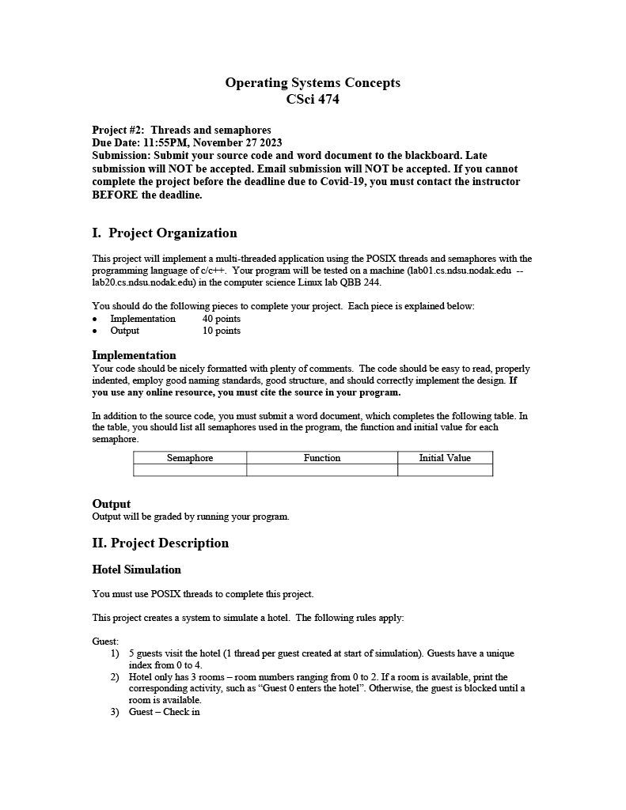
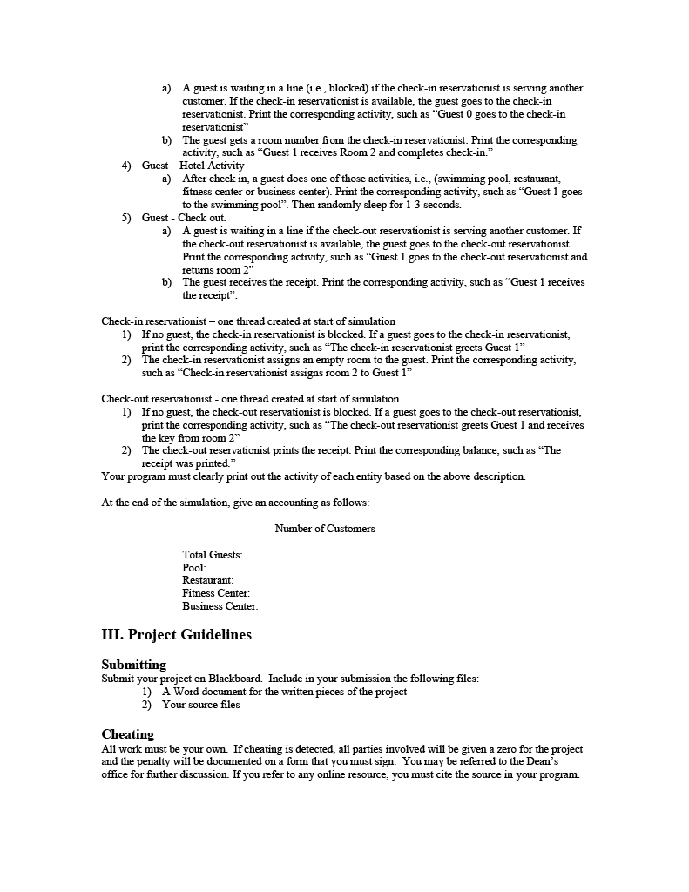

# CSCI-474-Project2


# These are the requirements for the project
<p align="center">
  
</p>

<p align="center">
  
</p>

<p align="center">
  
</p>

# Running the program
Note: Since this project uses linux specific libraries it can only run on a linux distro.

In order to run the program you are gonna need to compile it first. The compiler that'll be used is GCC.

## Installing GCC
To install GCC you will need to open the terminal.

* Once you have the terminal open typing this command will install it:
```
sudo apt install gcc
```
It'll then ask you for your password and then ask if you want to continue.

Once you do that GCC will start installing.

## Compiling the program
Now that gcc is installed you need to navigate to where ever you downloaded the program. Once you've navigated to where the program is, you'll need to compile the file.

* Running this command will compile it:[^1]
```
gcc Hotel.c -o Hotel.out -pthread
```
[^1]: -pthread is needed in order for the program to run correctly

After running the command a new file will be created. This is the file that we will run.

## Running
Now to run the program you can use this command:
```
./Hotel.out
```
Using this command will then run the program.

# How to use

